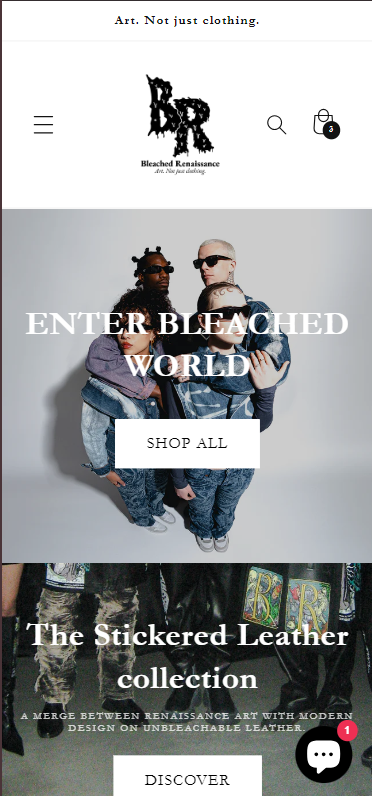
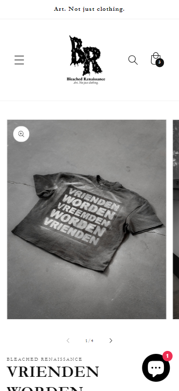
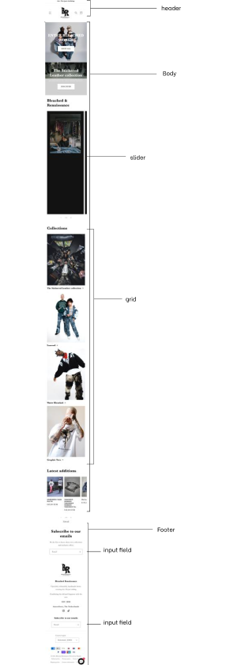

# Procesverslag
Markdown is een simpele manier om HTML te schrijven.  
Markdown cheat cheet: [Hulp bij het schrijven van Markdown](https://github.com/adam-p/markdown-here/wiki/Markdown-Cheatsheet).

Nb. De standaardstructuur en de spartaanse opmaak van de README.md zijn helemaal prima. Het gaat om de inhoud van je procesverslag. Besteedt de tijd voor pracht en praal aan je website.

Nb. Door *open* toe te voegen aan een *details* element kun je deze standaard open zetten. Fijn om dat steeds voor de relevante stuk(ken) te doen.

## Jij

  
uitwerken voor kick-off werkgroep

  ### Auteur:
  Daphne Jager

  #### Je startniveau:
  BLAUW

  #### Je focus:
  surface plane
 

## Je website

  
uitwerken voor kick-off werkgroep

  ### Je opdracht:
  https://bleachedrenaissance.nl/ 

  #### Screenshot(s) van de eerste pagina (small screen): 
  Bleached renaissance Home
  

  #### Screenshot(s) van de tweede pagina (small screen):
  Bleached renaissance Collections - 1 specifiek product pagina
  
 

## Toegankelijkheidstest 1/2 (week 1)

  
uitwerken na test in 2e werkgroep

  ### Bevindingen
  Lijst met je bevindingen die in de test naar voren kwamen:
  - bij de taal/geld werd deze 2 keer voorgelezen
  - logo heeft een goeie duidelijke alt text
  - website loopt vast als je wilt scrollen tijdens het readen, weet niet of het komt door de site of de reader.
  - de lijst wordt goed voorgelezen met 1/4 tot 4/4 
  - leest sommige dingen die niet zichtbaar zijn
  - als er fotos zijn met onderetiteling wordt er geen alt text bij de foto gegeven.

  A11y Checklist:
  - "Use plain language and avoid figures of speech, idioms, and complicated metaphors." De site gebruikt in de teksten
  best veel metaforen, wat wel a
  - "Make sure that button, a, and label element content is unique and descriptive." De twee knoppen zeggen "shop all" en "discover", dit is niet heel duidelijk over wat je nou gaat discoveren. Maar de text boven de knop maakt het dan wel weer wat meer duidelijk.
  - "Use left-aligned text for left-to-right (LTR) languages, and right-aligned text for right-to-left (RTL) languages." dit wordt wel gedaan.
  - "Validate your HTML." ik weet niet hoe ik hun html moet validaten?
  - "Use a lang attribute on the html element." Ja, die wordt gebruikt
  - "Provide a unique title for each page or view." Ze gebruiken een duidelijke titel
  - "Ensure that viewport zoom is not disabled." De viewport staat goed
  - "Use landmark elements to indicate important content regions." Dit wordt goed gedaan
  - "Ensure a linear content flow." 
  - "Avoid using the autofocus attribute." deze gebruiken ze niet
  - "Allow extending session timeouts." Hiervan weet ik niet goed hoe ik moet vinden of ze dit doen
  - "Remove title attribute tooltips." de informatie in hun title tag is niet extreem belangrijk, het verteld alleen de titel van de site.
  - "Make sure there is a visible focus style for interactive elements that are navigated to via keyboard input." Ja, je kan goed zien waar je bent op de website.
  - "Check to see that keyboard focus order matches the visual layout." Ja, alles is op een goede volgorde
  - "Remove invisible focusable elements." Er komt geen focus op elementen die het niet horen te hebben.
  - "Make sure that all img elements have an alt attribute." De foto's hebben geen of geen duidelijke alt text.
  - "Make sure that decorative images use null alt (empty) attribute values." De foto's hebben geen of geen duidelijke alt text.
  - "Provide a text alternative for complex images such as charts, graphs, and maps." De fotos hebben wel allemaal een alt source.
  - "For images containing text, make sure the alt description includes the image's text." er zijn geen foto's met text erop.
  - "Use heading elements to introduce content." dit wordt goed gedaan.
  - "Use only one h1 element per page or view." Er wordt maar 1 h1 gebruikt, maar hier staat verder geen text in.
  - "Heading elements should be written in a logical sequence." Dit wordt goed gedaan
  - "Don't skip heading levels." Dit wordt goed gedaan
  - "Use list elements (ol, ul, and dl elements) for list content." Dit wodt goed gedaan
  - "Use the a element for links." Dit wordt goed gedaan
  - "Ensure that links are recognizable as links." Niet alle links zijn underlined, bij sommige word hier een pijltje voor gebruikt, maar dat is ook duidelijk.
  - "Ensure that controls have :focus states." Dit klopt
  - "Use the button element for buttons." Dit klopt
  - "Provide a skip link and make sure that it is visible when focused." Dit hebben ze gedaan
  - "Identify links that open in a new tab or window." Er zijn geen links naar een ander tabblad
  - "Use the table element to describe tabular data." Zijn niet van toepassing
  - "Use the th element for table headers (with appropriate scope attributes)." Zijn niet van toepassing
  - "Use the caption element to provide a title for the table." Zijn niet van toepassing
  - "All inputs in a form are associated with a corresponding label element." Dit klopt
  - "Use fieldset and legend elements where appropriate." nvt
  - "Inputs use autocomplete where appropriate." bij email input wordt dit gebruikt.
  - "Make sure that form input errors are displayed in list above the form after submission." bij email input wordt dit gebruikt.
  - "Associate input error messaging with the input it corresponds to." De error message staat duidelijk bij het veld.
  - "Make sure that error, warning, and success states are not visually communicated by just color." Dit wordt goed gedaan
  - "Make sure that media does not autoplay." nvt
  - "Ensure that media controls use appropriate markup." nvt
  - "Check to see that all media can be paused." nvt
  - "Confirm the presence of captions." nvt
  - "Remove seizure triggers." nvt
  - "Confirm that transcripts are available." nvt
  - "Check your content in specialized browsing modes." Dit klopt
  - "Increase text size to 200%." Het is nog wel leesbaar, maar de letters worden wel heel groot
  - "Double-check that good proximity between content is maintained." Het is bruikbaar, maar wel wat lastiger
  - "Make sure color isn't the only way information is conveyed." dit wordt goed gedaan, alles is zwart wit
  - "Make sure instructions are not visual or audio-only." Dit klopt
  - "Use a simple, straightforward, and consistent layout." Dit is goed
  - "Ensure animations are subtle and do not flash too much" nvt
  - "Provide a mechanism to pause background video." nvt
  - "Make sure all animation obeys the prefers-reduced-motion media query." nvt
  - "Check the contrast for all normal-sized text." nvt
  - "Check the contrast for all large-sized text." goed
  - "Check the contrast for all icons." goed
  - "Check the contrast of borders for input elements (text input, radio buttons, checkboxes, etc.)." een beetje dun
  - "Check text that overlaps images or video." soms wat lastiger leesbaar
  - "Check custom ::selection colors." goed
  - "Check that the site can be rotated to any orientation." werkt
  - "Remove horizontal scrolling." goed
  - "Ensure that button and link icons can be activated with ease." goed
  - "Ensure sufficient space between interactive items in order to provide a scroll area." goed

## Breakdownschets (week 1)

  
uitwerken na afloop 3e werkgroep

  ### de hele pagina: 
  

  ### dynamisch deel (bijv menu): 
  

  ### wellicht nog een dynamisch deel (bijv filter): 
  

## Voortgang 1 (week 2)

  
uitwerken voor 1e voortgang

  ### Stand van zaken
  Ik had een beetje een hectische week, waardoor het wat lastiger was om goed door te werken en af te maken. 
  Maar uiteindelijk is het wel gelukt om te beginnen.
  De opbouw ging eigenlijk wel goed en makkelijk. Alleen de text kon ik niet kopieren dus ik heb alles
  over moeten typen helaas. Ik twijfelde over of ik de sections goed heb gebruikt. 

  ### Agenda voor meeting
  samen met je groepje opstellen

  | student 1      | student 2          | student 3    | student 4        |
  | ---            | ---                | ---          | ---              |
  | dit bespreken  | en dit             | en ik dit    | en dan ik dat    |
  | en dat ook nog | dit als er tijd is | nog een punt | dit wil ik zeker |
  | ...            | ...                | ...          | ...              |

  ### Verslag van meeting
  hier na afloop snel de uitkomsten van de meeting vastleggen

  - goed op weg
  - beginnen met css
  - nog een punt
  - ...

## Voortgang 2 (week 3)

  
uitwerken voor 2e voortgang

  ### Stand van zaken
  Ik had een moeilijke opstart met CSS, maar dit ging uiteindelijk wel beter. Nu moet ik Javascript nog doen, maar dit vind ik wel eng want ik weet daar eigenlijk niks meer van. 

  ### Agenda voor meeting
  samen met je groepje opstellen

  | student 1      | student 2          | student 3    | student 4        |
  | ---            | ---                | ---          | ---              |
  | ik vind het moeilijk om te beginnen met javascript  | en dit             | en ik dit    | en dan ik dat    |
  | de dark mode vind ik lastig | dit als er tijd is | nog een punt | dit wil ik zeker |
  | ...            | ...                | ...          | ...              |

  ### Verslag van meeting
  hier na afloop snel de uitkomsten van de meeting vastleggen

  - punt 1
  - punt 2
  - nog een punt
- ...

## Toegankelijkheidstest 2/2 (week 4)

  
uitwerken na test in 9e werkgroep

  ### Bevindingen
  Lijst met je bevindingen die in de test naar voren kwamen (geef ook aan wat er verbeterd is):

## Voortgang 3 (week 4)

  
uitwerken voor 3e voortgang

  ### Stand van zaken
  hier dit ging goed & dit was lastig (neem ook screenshots op van delen van je website en code)

  ### Agenda voor meeting
  samen met je groepje opstellen

  | student 1      | student 2          | student 3    | student 4        |
  | ---            | ---                | ---          | ---              |
  | dit bespreken  | en dit             | en ik dit    | en dan ik dat    |
  | en dat ook nog | dit als er tijd is | nog een punt | dit wil ik zeker |
  | ...            | ...                | ...          | ...              |

  ### Verslag van meeting
  hier na afloop snel de uitkomsten van de meeting vastleggen

  - punt 1
  - punt 2
  - nog een punt
  - ...

## Eindgesprek (week 5)

  
uitwerken voor eindgesprek

  ### Je uitkomst - karakteristiek screenshots:
  

  ### Dit ging goed/Heb ik geleerd: 
  Korte omschrijving met plaatjes

  

  ### Dit was lastig/Is niet gelukt:
  Korte omschrijving met plaatjes

  

## Bronnenlijst

  
continu bijhouden terwijl je werkt

  Nb. Wees specifiek ('css-tricks' als bron is bijv. niet specifiek genoeg). 
  Nb. ChatGpT en andere AI horen er ook bij.
  Nb. Vermeld de bronnen ook in je code.

  1. bron voor parralax: https://www.w3schools.com/howto/howto_css_parallax.asp
  2. CARROUSEL bron: https://blog.hubspot.com/website/bootstrap-carousel-css*
  3. hamburger Bron: DLO opdracht hamburger menu
  4. skip to content knop: https://css-tricks.com/how-to-create-a-skip-to-content-link/
  5. inputfield opmaak: https://www.w3schools.com/css/css_form.asp

